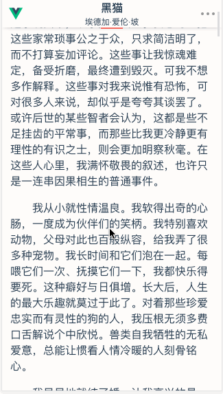
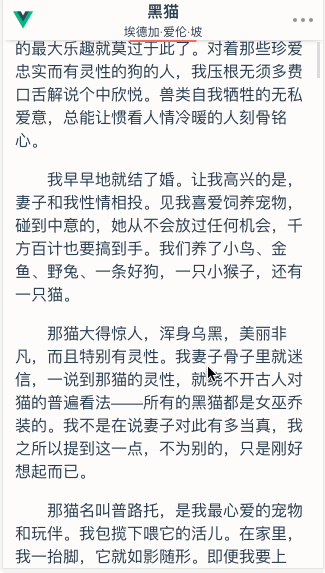
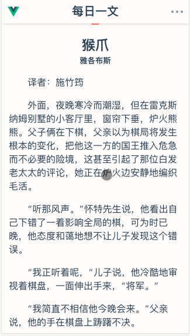

# Vue-每日一文

这段时间学习vue 还是边撸小项目边学比较容易掌握

>感谢@jokermonn无私提供的各种API [jokermonn](https://github.com/jokermonn)/**[-Api](https://github.com/jokermonn/-Api)**

>感谢 [每日一文](https://meiriyiwen.com/)

>之后陆续还会用其他的api再撸撸小项目

在线演示地址： [点我访问](http://www.cr0wn0209.me/vue-meiriyiwen)
（手机直接访问、pc端打开开发者工具栏手机模式）

github项目地址：[点我访问](https://github.com/Cr0wn0209/vue-meiriyiwen)

---
## Build Setup

``` bash
# clone
git clone https://github.com/Cr0wn0209/vue-meiriyiwen.git

# install dependencies
npm install

# serve with hot reload at localhost:8080
npm run dev

# build for production with minification
npm run build
```
---
## 技术栈

 - vue+vue-router

 - [axios](https://www.npmjs.com/package/axios)

## 功能设计

 - 今日文章（主页）

 - 随机一文

 - 前一天、后一天的文章

 - 顶部进度条 （自己的想法）

 - 滚动遮住文章标题后在顶部显示文章标题 （参考了知乎的设计）

## 预览


参考了每日一文官方APP的一些设计，在此基础上加入了自己的一些想法，现在版本围绕api的功能都实现了，之后准备加入官方app里的收藏文章功能、阅读设置功能（文字大小、背景色、夜间模式等...），这是我接触vue的第一个小项目啦，功能也不很少很简单，还有很多地方我觉得实现方式不太好，对Vue的掌握还是太浅啦


###### 动图 1


###### 动图 2


###### 动图 3


###### 首页-今日文章


###### 随机一文-文章底部


###### 菜单


个人学习用，有什么建议请积极提出，请勿商用，求个小星星鼓励下我这个小菜鸡啦~
