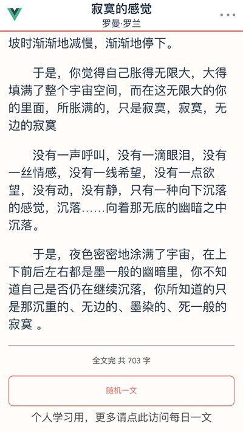
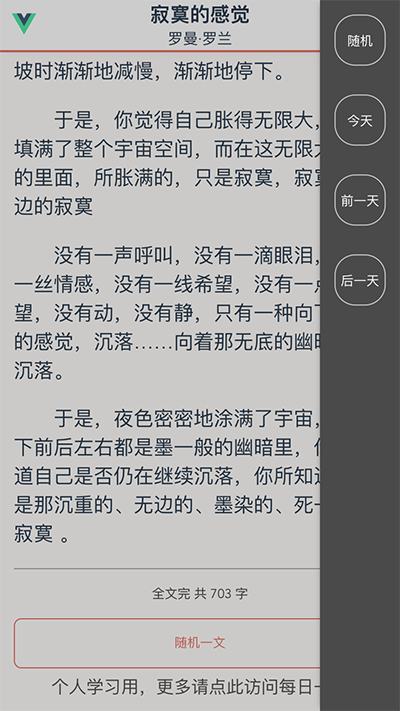

# Vue-每日一文
这段时间学习vue 还是边撸小项目边学比较容易掌握

>感谢@jokermonn无私提供的各种 [API](https://github.com/jokermonn/-Api)

>之后陆续还会用别的api再撸撸小项目

在线演示地址： [点我访问](http://www.cr0wn0209.me/vue-meiriyiwen)
（手机直接访问、pc端打开开发者工具栏手机模式）

github项目地址：[点我访问](https://github.com/Cr0wn0209/vue-meiriyiwen)

---
## Build Setup

``` bash
# clone
git clone https://github.com/Cr0wn0209/vue-meiriyiwen.git

# install dependencies
npm install

# serve with hot reload at localhost:8080
npm run dev

# build for production with minification
npm run build
```
---
## 技术栈

 - vue+vue-router

 - [axios](https://www.npmjs.com/package/axios)

## 功能设计

 - 今日文章

 - 随机一文

 - 前一天、后一天的文章

 - 顶部进度条 （自己的想法）

 - 滚动遮住文章标题后在顶部显示文章标题 （参考了知乎的设计）

## 预览

首先我先参考了现有的每日一文APP的一些设计，再次基础上加入了自己的一些想法，主要是入门vue的一些基础的功能，现在围绕api的功能都实现了，之后准备加入官方app里的收藏文章功能，有很多地方我觉得实现方式不太好，对vue的掌握还是太浅，
###### 首页-今日文章


###### 随机一文-文章底部


###### 菜单

